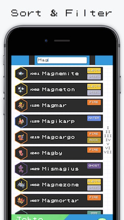

#  Pokétch
[__It's a hi-tech encyclopedia!__](http://poketch.pcperini.com)
In honor of Pokémon's 20th Anniversary, Pokétch is a fan-made Pokémon reference app for iOS and watchOS.

&nbsp;

&nbsp;

:fire: Quickly scroll through all Pokémon in their National Dex order.

:droplet: Sort by name, number, or type, and filter to search on your iPhone or Apple Watch.

:leaves: Take a spin around the world of Pokémon with the Live Region Indicator.

:zap: Always know which types trump which Pokémon with quick Weak and Resistant references.

&nbsp;

